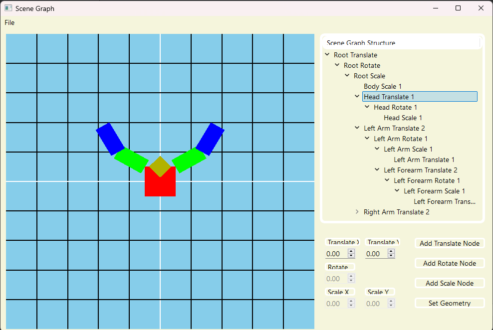

# SceneGraph

A scene graph is a node-based tree data structure used to organize geometry in computer graphics. Each node contains a transformation matrix, and child nodes inherits the transformations of their parent nodes. This project uses Qt to build a simple GUI for scene graph visualization and transformation manipulation.